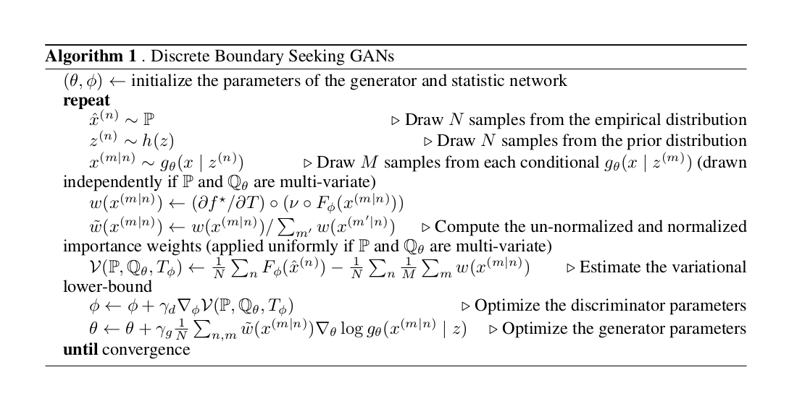

PyTorch Implementation of Boundary Seeking GAN
==============================================




Unofficial PyTorch implementation of [Boundary Seeking GAN](https://arxiv.org/abs/1702.08431) for discrete data generation.

|           Binary MNIST, 20k steps / 50 epochs                         |           Discrete CelebA with 16 colors, 80k steps / 50 epochs       |
|:---------------------------------------------------------------------:|:---------------------------------------------------------------------:|
|  |  |

Usage
-----

### Discrete MNIST

Train BGAN on binary MNIST.

```bash
python train.py disc_mnist
```

### Quantized CelebA

#### Create quantized CelebA dataset
`utils/create_quantized_celeba.py` is provided as a utility to create a discrete version of CelebA quantized to a given number of colors.

It requires the dataset to be already downloaded and extracted. The resulting quantized version will be saved to the provided target directory.

The resulting images are stored as PNG files for convenience and efficient space usage.
Note, that this has the implication, that the number of colors is limited to a maximum of 256.

```bash
python utils/create_quantized_celeba.py --num-colors=16 --size=64 <path to celeba> <target path>
```

In opposition to the original paper, which uses the Pillow library for quantization, the utility uses K-Means to learn the color palette on a subset of the data and undertake the actual quantization. This leads to better results but is computationally more expensive.

#### Train

After the quantized training data has been created, the model can be trained with the following command:

```bash
python train.py disc_celeba --data-path=<path to qunatized celeba>
```


Notes
-----

### Differences to the paper

The original paper provides little information about the exact implementation and training parameters for the conducted experiments (see section 4.2).

There appears to be an official implementation (see https://github.com/rdevon/BGAN) in Theano but it does not seem to follow the paper in an exact way.

Following points probably cover the most significant differences to the original implementation:

- The model architecture loosely follows DCGAN, same as the original implementation but might differ in the choice of number of filters, etc.
- We recommend using ELU activation function instead of (leaky) ReLU, at least for datasets with higher resolution and number of classes.
- The mean over the log-likelihoods of the generator output is computed instead of the sum as in the original implementation. Latter leads to a loss and hence gradient magnitudes, which are dependent on the number of classes/channels and resolution which would require - at least in theory - learning rate adjustment, effectively adding another hyperparameter.

### Tips for training

Discrete data training with GANs is usually much more difficult than the already difficult GAN training for continuous data.

Boundary Seeking GANs seem to be an improvement in this relation but are still sensitive to the correct hyperparameter and architecture configuration.

In particular, the following points should be noted:

- Putting the batch norm layer **after** the non-linearity (conv -> activation -> bn) instead of before, like it's usually recommended and also done in the original DCGAN architecture, seems to drastically improve the performance for some, to me yet unknown reasons.
- BGAN training seems to be even more prone to mode-collapse as the generator is trained with sparse gradients which oftentimes leads to the discriminator learning much faster than the generator. Depending on the actual problem setting and data, this effect can be mitigated by increasing the number of monte-carlo samples (`--n-mc-samples`), lowering the learning rate for D (`--d-lr`) or add noise to D's input. Furthermore, [spectral normalization](https://arxiv.org/abs/1802.05957) also seems to have a positive effect which can be applied with the `--spectral-norm` flag of the training script.
- Due to the monte-carlo sampling, every generator optimization step requires `m` discriminator passes, where `m` is set to 20 by default. While more monte-carlo samples seem to improve the performance, especially for larger number of classes, it has a quadratic impact on the computational requirements. Therefore it is recommended to start experimenting with lower values before going up to larger ones, which may strongly affect the training time.
- While a discriminator loss of zero can be seen as a failure state for "normal" GANs, in the BGAN setting, this may be a normal observation, especially in the beginning of training from which the generator might recover. As long as a mode collapse does not occur and G seems to improve, training can be continued.
- The original implementation seems to use ReLU as activation function. We experimented both with ReLU and leaky ReLU with an alpha of 0.2, following many recent GAN implementations and found both performing similarly well. Using ELU in both the generator and discriminator also has proven to be advantageous in some cases and seems to mitigate the problem of generator-discriminator imbalance. We haven't investigated yet, if latter fact can be attributed to a more powerful G or a degenerate D. As generation quality does significantly improve despite better G-D balance, we attribute it to latter case.


Todo
----

- Implement sampling from an exponential moving averages generator
- Implement FID to compare different parameter settings
- Implement a text generation example